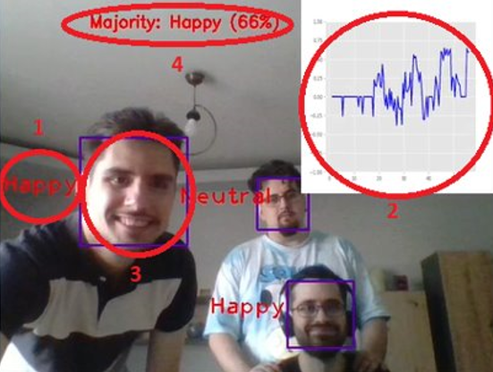

# AI-Facial-Emotion-Detection
This is an application created using Artificial Intelligence to detect emotions from group facial expressions

1. Emotion of detected face
2. Graph of aggregated results
3. Bounding box
4. Majority label

## Workflow

- Haarcascade-frontal is used to detect faces
- These are cropped out and fed into the a trained CNN model for inference
- Highest probability label is the outputted as the corresponding emotion
- After detection for all faces, the group label is decided by the majority emotion

## There are 4 emotions categorized in 3 states: negative, neutral and positive

* 0: "Angry" - negative
* 1: "Happy" - positive
* 2: "Neutral" - neutral
* 3: "Fear" - negative

The graph is meant as a visual indicator of the general emotional state of the crowd

# Usage

The script for detection is main.py, it has 2 uses:

* Record emotions using webcam
* Print a graph and metrics from a prexisting recording

## Recording

* Run main.py and press 1 when prompted in the terminal to record. This will make use the default webcam.
* To quit recording press 'esc'. This will save the emotion graph values to the graphs folder

## Plotting

* Run main.py and press 2 when prompted in the terminal to record
* Provide the path to the graph you wish to plot/run stats on
* Input L to list options or input the number of the desired command in the terminal

## Options

1. plot Graph
2. show all stats
3. show engagement percentage
4. show positive engagement percentage
5. show negative engagement percentage
6. show neutral percentage
7. show mean
8. show maximum positive enagement time
9. show maximum negative engagement time
10. show maximum engagement time, regardless of classification
11. show maximum y value
12. show minimum y value

q - quit

